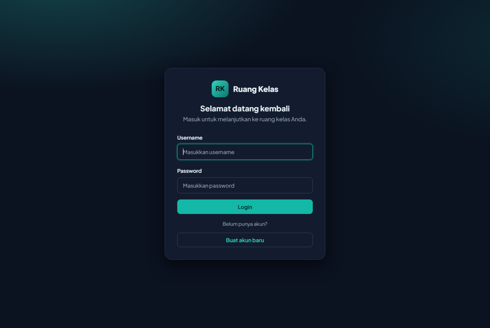
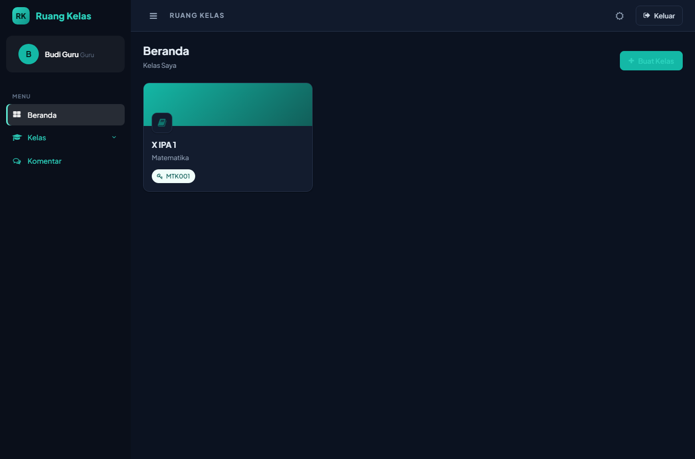
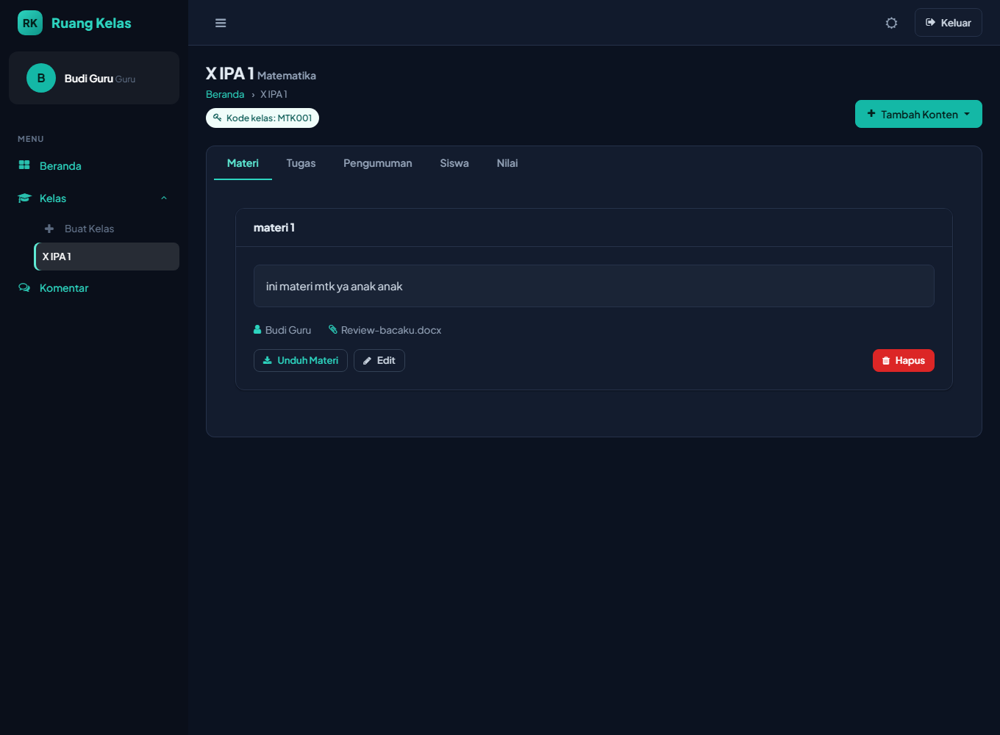
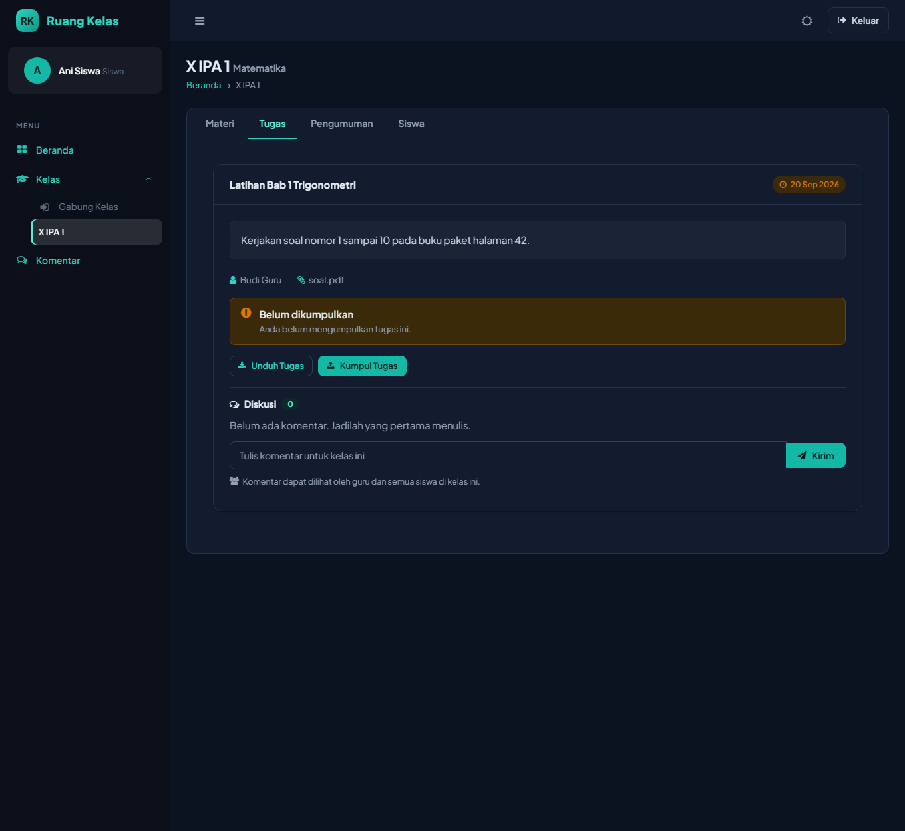
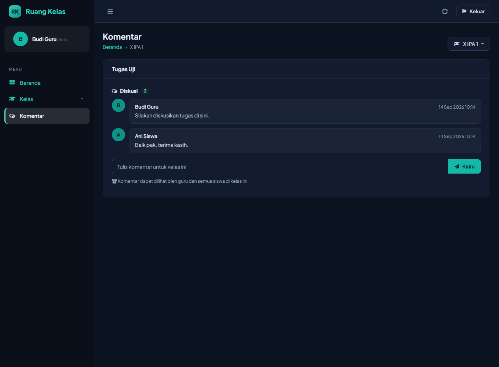

# Ruang Kelas — Secure Classroom Management (LMS)

A lightweight learning-management app where teachers run classes and students join, submit work,
and discuss. Built from scratch in **plain PHP 8.1 + MySQL** on a small hand-written MVC core —
no framework — with security as the primary design goal.

> This project started as an existing, vulnerable PHP codebase and was **audited and rebuilt**:
> every SQL query moved to prepared statements, passwords hashed, access control enforced on the
> server, CSRF and session hardening added, file uploads locked down, and the UI redesigned into a
> responsive, themeable interface. The security work is the point of the project.


<p align="center">
  
</p>

## Table of contents

- [What it does](#what-it-does)
- [Security highlights](#security-highlights)
- [Architecture](#architecture)
- [Tech stack](#tech-stack)
- [Getting started](#getting-started)
- [Design decisions](#design-decisions)
- [Possible next steps](#possible-next-steps)
- [Screenshots](#screenshots)

## What it does

**Teachers**

- Create classes with an auto-generated, unguessable join code
- Publish materials and assignments (deadline + file attachment)
- Post, edit, and delete announcements
- See enrolled students and grade every submission on one screen
- Read and reply to a discussion thread on each assignment

**Students**

- Join a class with the teacher's code
- Download materials and assignment files
- Submit and re-submit assignment files
- Take part in the assignment discussion

Roles are enforced end to end: the UI hides what you cannot do, and the server independently
rejects any request you are not authorized to make.

## Security highlights

Security was treated as a feature, not an afterthought. The table maps common web risks to how the
app addresses them.

| Risk | How it is handled | Where |
|------|-------------------|-------|
| SQL injection | Every query is a parameterized prepared statement; no user input is ever concatenated into SQL | `App\Core\Database`, all repositories |
| Broken access control / IDOR | Per-route access rules (guest / auth / teacher / student) **plus** ownership-or-enrollment checks on every classroom resource | `App\Core\Router`, `App\Services\ClassroomPolicy`, `Controller::classroomResourceOrFail()` |
| Weak credentials | Passwords stored with `password_hash()` and verified with `password_verify()`, rehashed on algorithm upgrade | `App\Services\AuthService` |
| CSRF | Synchronizer token required on every state-changing (`POST`) route, enforced globally by the router | `App\Core\Csrf` |
| Cross-site scripting | All template output escaped through a single `e()` helper; a strict Content-Security-Policy forbids inline scripts | views, `App\Core\App` |
| Unrestricted file upload | Uploads validated by extension **and** detected MIME type, stored under a random name **outside the web root**, and served only through an authorization-checked download route | `App\Core\FileStorage`, `DownloadController` |
| Brute-force login | Failed attempts throttled per username and per IP address with a lockout window | `App\Repositories\LoginAttemptRepository` |
| Session attacks | `HttpOnly` + `SameSite=Lax` cookies, `Secure` on HTTPS, session ID regenerated on login, idle timeout | `App\Core\Session` |
| Information disclosure | Errors logged server-side; users see generic messages; secrets live in `.env` (git-ignored) | `App\Core\App`, `config.php` |
| Clickjacking / sniffing | `X-Frame-Options`, `X-Content-Type-Options`, `Referrer-Policy`, and HSTS on HTTPS | `App\Core\App` |

## Architecture

A request flows through a single front controller and a thin, layered core:

```
public/index.php  →  Router  →  Controller  →  Service / Repository  →  Database
                       │            │
                  access rule   View (escaped PHP templates)
                  + CSRF check
```

- **Controllers** stay thin: validate input, call a service or repository, redirect or render.
- **Repositories** own all SQL and return plain arrays — the only layer that talks to the database.
- **Services** hold business rules (authentication, authorization policy, class-code generation).
- **Core** is a small framework: router, request, session, CSRF, auth, database, view, validator, uploads.
- **Views** are plain PHP templates composed from layouts and reusable partials.

```
app/
  bootstrap.php     Boots the app (autoloader, helpers, config)
  routes.php        Route table with a per-route access rule
  Controllers/      One controller per feature
  Core/             Router, Request, Session, Csrf, Auth, Database, View, Validator, FileStorage
  Repositories/     All SQL, prepared statements only
  Services/         AuthService, ClassroomPolicy, ClassCodeGenerator
  Support/          Helpers and role constants
  Views/            Layouts, partials, and pages
database/
  migrations/       SQL migrations
  scripts/          One-off maintenance scripts
  ruangKelas.sql    Full schema + demo data
public/             Web root: front controller + static assets
storage/            Logs and uploaded files (never web-served directly)
```

## Tech stack

- **Backend:** PHP 8.1 (typed, `declare(strict_types=1)`), custom PSR-4 autoloader
- **Database:** MySQL 8 / MariaDB, `mysqli` prepared statements
- **Frontend:** server-rendered PHP templates, Bootstrap grid, a hand-built design system (CSS custom properties, light/dark themes), vanilla JS
- **Tooling:** no runtime dependencies; configuration via `.env`

## Getting started

**Requirements:** PHP 8.1+ with `mysqli`, `fileinfo`, `mbstring`; MySQL 8 / MariaDB 10.4+; a web
server that can route to `public/index.php` (Apache with `mod_rewrite`, or PHP's built-in server).

```bash
# 1. Configure the environment
cp .env.example .env         # then edit DB credentials (use a least-privilege MySQL user)

# 2. Create the database and load the schema + demo data
mysql -u root -p -e "CREATE DATABASE ruangkelas CHARACTER SET utf8mb4 COLLATE utf8mb4_general_ci;"
mysql -u root -p ruangkelas < database/ruangKelas.sql

# 3. Run it (development)
php -S localhost:8000 -t public public/index.php
```

Then open <http://localhost:8000>.

**Demo accounts** (from the seed data — change them before any real deployment):

| Role | Username | Password |
|------|----------|----------|
| Teacher | `guru1` | `guru123` |
| Student | `siswa1` | `siswa123` |

For production, serve `public/` as the document root, make `storage/` writable, and set
`APP_DEBUG=false`. Set `TEACHER_INVITE_CODE` in `.env` to allow teacher self-registration;
without it, every new account is a student. The app interface is in Indonesian.

## Design decisions

- **No framework, on purpose.** The goal was to demonstrate the fundamentals a framework hides —
  routing, a request lifecycle, CSRF, sessions, prepared statements, access control — in code small
  enough to read end to end. The core is deliberately minimal and could be swapped for Laravel or
  Slim without touching the repository or service layers.
- **Repository layer.** Keeping every query in one layer made it straightforward to guarantee that
  *all* database access is parameterized, and keeps controllers readable.
- **Authorization in two places.** The router checks the coarse role; each controller re-checks that
  the specific record belongs to a class the user owns or is enrolled in. Hiding a button is never
  treated as a security control.
- **Uploads outside the web root.** Files are stored in `storage/` and streamed through a controller
  that checks access first, so a direct URL guess cannot leak another user's submission.

## Possible next steps

Honest list of what I would add to take this from a solid build to production-grade:

- Automated tests (PHPUnit) for authentication, authorization/IDOR, and validation
- A Dockerfile + `docker-compose` for one-command setup
- Composer autoloading and static analysis (PHPStan) / coding-standard checks in CI
- A hosted live demo

## Screenshots

| Teacher dashboard | Class materials |
|---|---|
|  |  |

| Assignment + discussion (student) | Comments |
|---|---|
|  |  |

The interface ships with light and dark themes; the shots above are the dark theme.
